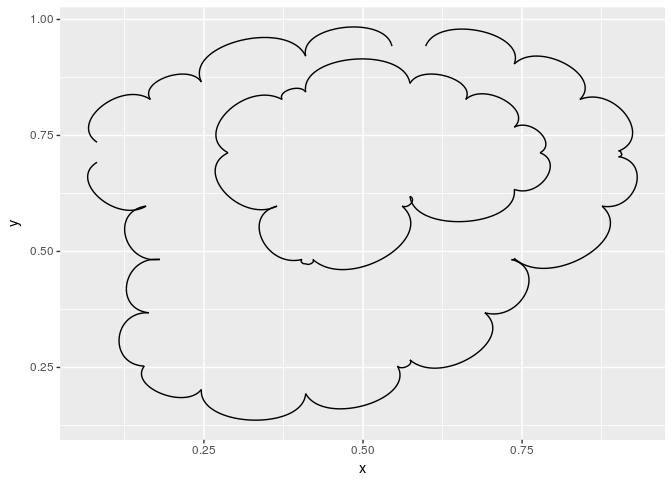
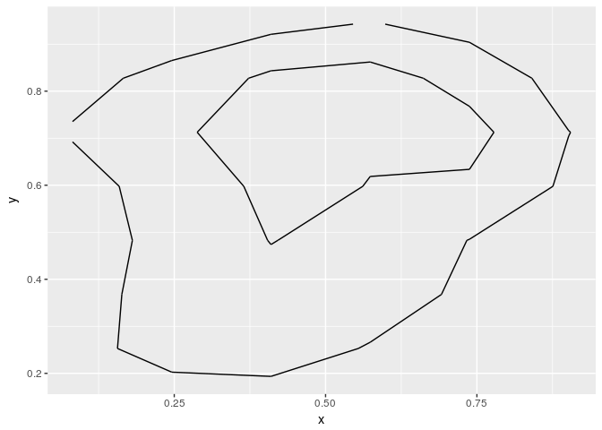
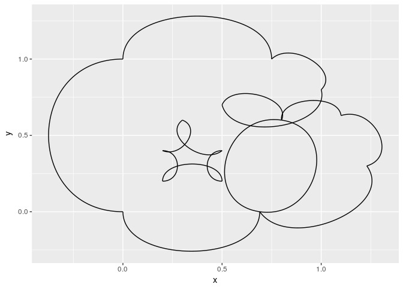
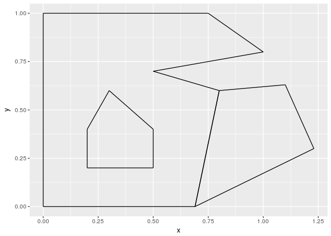
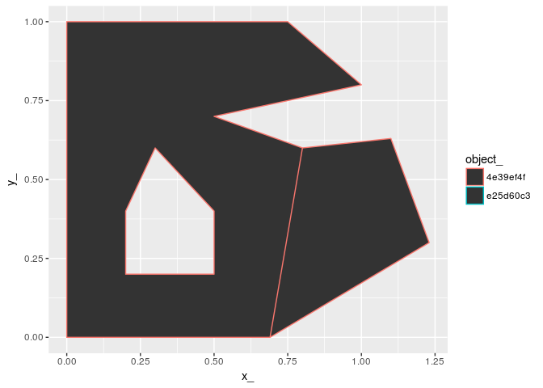

<!-- README.md is generated from README.Rmd. Please edit that file -->
[](https://travis-ci.org/mdsumner/scgraph)

[](https://ci.appveyor.com/project/mdsumner/scgraph)

    ## Loading required package: sc

    ## Loading required package: sp

    ## 
    ## Attaching package: 'dplyr'

    ## The following objects are masked from 'package:raster':
    ## 
    ##     intersect, select, union

    ## The following objects are masked from 'package:stats':
    ## 
    ##     filter, lag

    ## The following objects are masked from 'package:base':
    ## 
    ##     intersect, setdiff, setequal, union

scgraph
=======

The goal of scgraph is to convert other stuff to igraph.

(In time scgraph might convert igraph to other stuff. )

Installation
------------

You can install scgraph from github with:

``` r
# install.packages("devtools")
devtools::install_github("mdsumner/scgraph")
```

Example
-------

This is a basic example which shows you how to create graphs, from non-graph data that has connectivity understood by the 'sc' framework.

First generate some line data.

``` r
library(scsf)
library(raster)
r <- aggregate(raster(volcano), fact = 10)
line <- sf::st_as_sf(rasterToContour(r, levels = c(130, 165)))
plot(line)
```


Convert to graph, the first is a bit of a mess since we are plotting it in "space"-space. The second does more work to show the topology more clearly with two disconnected lines and the single ring.

(That's the idea.)

``` r
library(scgraph)
plot(as.igraph(line), vertex.size = 5)
```


``` r
plot(as.igraph(line, layout = FALSE), vertex.size = 5)
```


Another example. Here the "hole" in the spatial polygon is seen as a disconnected island, and the two polygons that share an edge running in two different path directions are together.

``` r
data("minimal_mesh", package = "scsf")
set.seed(10)  ## WIP sc::PRIMITIVE will currently always have new UIDs for the same data
sc_model <- PRIMITIVE(minimal_mesh)
ggeog <- as.igraph(sc_model, layout = TRUE)
gtopo <- as.igraph(sc_model, layout = FALSE)

## can't see how else to easily remove the geographic layout?
#igraph::V(gtopo)$name <- igraph::V(ggeog)$name
## drop IDs and use an integer
#igraph::V(gtopo)$name <- igraph::V(ggeog)$name <- seq_along(igraph::V(ggeog)$name)
#p <- par(mfrow = c(1, 2))
library(igraph)
#> 
#> Attaching package: 'igraph'
#> The following objects are masked from 'package:dplyr':
#> 
#>     %>%, as_data_frame, groups, union
#> The following object is masked from 'package:raster':
#> 
#>     union
#> The following objects are masked from 'package:stats':
#> 
#>     decompose, spectrum
#> The following object is masked from 'package:base':
#> 
#>     union
plot(ggeog, vertex.size = 9, main = "layout as geography", vertex.label.dist= .7, vertex.label.cex = 1)
```


``` r
plot(gtopo, vertex.size = 9, main = "layout as topology", vertex.label.dist= .7, vertex.label.cex = 1)
```


``` r
library(ggraph)
#> 
#> Attaching package: 'ggraph'
#> The following object is masked from 'package:sp':
#> 
#>     geometry
g <- as.igraph(line)
ggraph(g) + geom_edge_arc()
#> Using `nicely` as default layout
```



``` r

ggraph(g) + geom_edge_link() 
#> Using `nicely` as default layout
```



The geom edge link is essentially the same as the map data.

``` r
library(ggraph)
ggraph(ggeog) + geom_edge_arc()
#> Using `nicely` as default layout
```



``` r

ggraph(ggeog) + geom_edge_link() 
#> Using `nicely` as default layout
```



``` r

## reconstruct the sf object as a ggplot
## using the sc decomposition forms that scgraph uses
sc_model <- PRIMITIVE(minimal_mesh)
library(dplyr)
## a kind of db-fortify
tab <- with(sc_model, 
     object %>% inner_join(path) %>% inner_join(path_link_vertex) %>% inner_join(vertex))
#> Joining, by = "object_"
#> Joining, by = "path_"
#> Joining, by = "vertex_"
library(ggplot2)
ggplot(tab, aes(x_, y_, group = path_, col = object_)) + ggpolypath::geom_polypath()
```

 \#\# Notes

AT this link is efforts for threejs:

<https://gist.github.com/mdsumner/0a9207a58898eed30c07fba7ec5e959b>

Here's direct ggraph, cannot get it to work with ggmap

``` r
#install.packages("ggmap")
#install.packages("ggraph")
#devtools::install_github("mdsumner/scsf")
library(ggmap)

us <- c(left = -125, bottom = 25.75, right = -67, top = 49)
map <- get_stamenmap(us, zoom = 5, maptype = "toner-lite")

library(USAboundaries)

## pick any county with a hole in it
hc <- USAboundaries::us_counties()[unlist(fortify(USAboundaries::us_counties()) %>% filter(hole) %>% distinct(id)), ]

## this one has two hole
bb <- sp::bbox(hc[4, ])
county <- fortify(hc[4, ])
map <- get_stamenmap(as.vector(bb), zoom = 10, maptype = "toner-lite")
ggmap(map)

library(ggplot2)
## traditional 
ggmap(map) +  geom_polygon(fill = scales::alpha("firebrick", 0.5), 
                                       aes(x = long, y = lat, group = group, colour = id), data = county)  
  
## with proper holes
ggmap(map) +  ggpolypath::geom_polypath(fill = scales::alpha("firebrick", 0.5), 
                           aes(x = long, y = lat, group = group, colour = id), data = county)  


## ggraph from primitives (line segments)
library(scsf)  ## only sf supported in the spatial family so far
prim <- sc::PRIMITIVE(sf::st_as_sf(hc[4, ]))


graph_primitive_layout <- function(prim) {
  g <- igraph::graph_from_data_frame(prim$segment %>% rename(from = .vertex0, to = .vertex1))
  igraph::V(g)$x <- prim$v$x_[match(names(igraph::V(g)), prim$v$vertex_)]
  igraph::V(g)$y <- prim$v$y_[match(names(igraph::V(g)), prim$v$vertex_)]
  g
}

library(ggraph)

g <- graph_primitive_layout(prim)
lyout <- cbind(igraph::V(g)$x, igraph::V(g)$y)
ggraph(g) +
  geom_edge_link(aes(colour = segment_)) + geom_node_point() 
```

``` r
library(ggraph)
library(igraph)
#devtools::install_github(c("mdsumner/sc", "mdsumner/scsf"))
library(scsf)
data("minimal_mesh")
prim <- sc::PRIMITIVE(minimal_mesh)
library(dplyr)
mm_g <- graph_from_data_frame(prim$segment %>% rename(from = .vertex0, to = .vertex1))

library(sf)
nc <- st_read(system.file("shape/nc.shp", package="sf"), quiet = TRUE)

plot(nc[4:10, 1:2])
prim <- PRIMITIVE(nc[4:10, ])
nc_g <- graph_from_data_frame(prim$segment %>% rename(from = .vertex0, to = .vertex1))


ggraph(nc_g, layout = 'kk') +
  geom_edge_link(aes(colour = as.numeric(factor(segment_))))

ggraph(nc_g, layout = 'kk') +
  geom_edge_link(aes(colour = path_))

##devtools::install_github("mdsumner/sfdct")
#data("antarctica", package = "sfdct")

data("wrld_simpl", package = "maptools")
oz <- sp::disaggregate(subset(wrld_simpl, NAME == "Australia"))
tas <- st_as_sf(subset(oz, sp::coordinates(oz)[, 2] < -40))
plot(st_geometry(tas))


prim <- PRIMITIVE(tas)
tas_g <- graph_from_data_frame(prim$segment %>% rename(from = .vertex0, to = .vertex1))
ggraph(tas_g, layout = 'kk') +
  geom_edge_link(aes(colour = path_))


ggraph(tas_g, layout = 'kk') +
  geom_edge_link(aes(colour = as.numeric(factor(segment_))))


## -------------------------------------------------------------

library(ggraph)
library(igraph)
hierarchy <- as.dendrogram(hclust(dist(iris[, 1:4])))

# Classify nodes based on agreement between children
hierarchy <- tree_apply(hierarchy, function(node, children, ...) {
  if (is.leaf(node)) {
    attr(node, 'Class') <- as.character(iris[as.integer(attr(node, 'label')),5])
  } else {
    classes <- unique(sapply(children, attr, which = 'Class'))
    if (length(classes) == 1 && !anyNA(classes)) {
      attr(node, 'Class') <- classes
    } else {
      attr(node, 'Class') <- NA
    }
  }
  attr(node, 'nodePar') <- list(class = attr(node, 'Class'))
  node
}, direction = 'up')

hairball <- graph_from_data_frame(highschool)

# Classify nodes based on popularity gain
pop1957 <- degree(delete_edges(hairball, which(E(hairball)$year == 1957)), 
                  mode = 'in')
pop1958 <- degree(delete_edges(hairball, which(E(hairball)$year == 1958)), 
                  mode = 'in')
V(hairball)$pop_devel <- ifelse(pop1957 < pop1958, 'increased',
                                ifelse(pop1957 > pop1958, 'decreased', 
                                       'unchanged'))
V(hairball)$popularity <- pmax(pop1957, pop1958)
E(hairball)$year <- as.character(E(hairball)$year)
```
